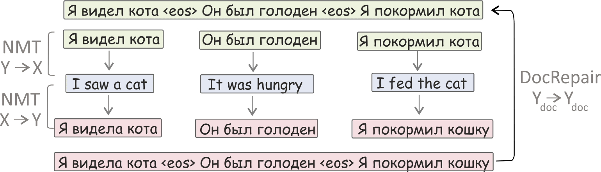
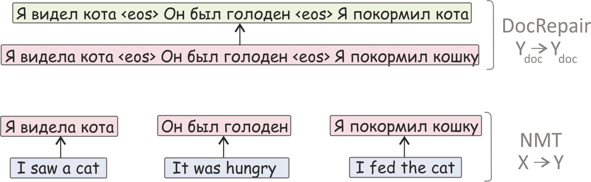

## When a Good Translation is Wrong in Context

This is the official repo for 
* the ACL 2019 paper ["When a Good Translation is Wrong in Context: Context-Aware Machine Translation Improves on Deixis, Ellipsis, and Lexical Cohesion"](https://www.aclweb.org/anthology/P19-1116)  
* the EMNLP 2019 paper ["Context-Aware Monolingual Repair for Neural Machine Translation"](https://arxiv.org/abs/1909.01383).

Read the official [blog post](https://lena-voita.github.io/posts/acl19_context.html) for the details!


1. [Introduction](#introduction)
1. [CADec: Context-Aware Decoder](#cadec)
1. [DocRepair: Context-Aware Monolingual Repair](#docrepair)
1. [Experiments: how to train the models](#experiments)
1. [Consistency test sets for evaluation of several discourse phenomena](#consistency-test-sets)
1. [Training data (for both CADec and DocRepair)](#training-data)

#### Bibtex
```
@inproceedings{voita-etal-2019-good,
    title = "When a Good Translation is Wrong in Context: Context-Aware Machine Translation Improves on Deixis, Ellipsis, and Lexical Cohesion",
    author = "Voita, Elena  and
      Sennrich, Rico  and
      Titov, Ivan",
    booktitle = "Proceedings of the 57th Annual Meeting of the Association for Computational Linguistics",
    month = jul,
    year = "2019",
    address = "Florence, Italy",
    publisher = "Association for Computational Linguistics",
    url = "https://www.aclweb.org/anthology/P19-1116",
    doi = "10.18653/v1/P19-1116",
    pages = "1198--1212",
}

@inproceedings{voita-etal-2019-context,
    title = "Context-Aware Monolingual Repair for Neural Machine Translation",
    author = "Voita, Elena  and
      Sennrich, Rico  and
      Titov, Ivan",
    booktitle = "Proceedings of the 2019 Conference on Empirical Methods in Natural Language Processing and the 9th International Joint Conference on Natural Language Processing (EMNLP-IJCNLP)",
    month = nov,
    year = "2019",
    address = "Hong Kong, China",
    publisher = "Association for Computational Linguistics",
    url = "https://www.aclweb.org/anthology/D19-1081",
    doi = "10.18653/v1/D19-1081",
    pages = "876--885",
}
```

<a name="introduction"></a>
## Introduction

In the ACL paper, we

* find the phenomena which cause context-agnostic translations to be inconsistent with each other;

* create contrastive test sets specifically addressing the most frequent phenomena (deixis, ellipsis, lexical cohesion);

* propose a novel and realistic set-up for context-aware NMT with a large amount of sentence-level data and much less of document-level data;

* introduce a model for this set-up (Context-Aware Decoder, aka CADec) - a two-pass machine translation model which first produces a draft translation of the current sentence, then corrects it using context.

In the EMNLP paper, we go further in using less of document-level data and

* introduce DocRepair - the first approach to context-aware machine translation using only monolingual document-level data;

* show that DocRepair improves translation quality as measured with BLEU, evaluation using contrastive test sets (introduced in the ACL paper) and human evaluation;

* show which discourse phenomena are hard to capture using only monolingual document-level data.

In this repo, we provide code and describe steps needed to reproduce our experiments. We also release consistency test sets for evaluation of several discourse phenomena (deixis, ellipsis and lexical cohesion) and provide the training data we used.

<a name="cadec"></a>
## CADec: Context-Aware Decoder
CADec is __specifically__ designed for __a novel setting__ with a lot of sentence-level data, __only a small subset of which is at the document level__. 

In our method, the initial translation produced by a baseline context-agnostic model is refined by a context-aware system which is trained on a small document-level subset of parallel data. As the first-pass translation is produced by a strong model, we expect no loss in general performance when training the second part on a smaller dataset.
Look at the illustration of this process.


More formally, the first part of the model is a context-agnostic model (we refer to it as the base model), and the second one is a context-aware decoder (CADec) which refines context-agnostic translations using context. The base model is trained on sentence-level data and then fixed. It is used only to sample context-agnostic translations and to get vector representations of the source and translated sentences. CADec is trained only on data with context. 

At training time, to get a draft translation of the current sentence we either sample a translation from the base model or use a corrupted version of the reference translation with probability `p = 0.5`. At test time, draft translation is obtained from the base model using beam search.

<a name="docrepair"></a>
## DocRepair: Context-Aware Monolingual Repair

We push further the idea of using less document-level parallel data and propose __the first approach__ of using __only monolingual document-level data__ for context-aware MT: the DocRepair model.

The DocRepair model corrects inconsistencies between sentence-level translations of a context-agnostic MT system (baseline system). It does not use any states of a trained MT model whose outputs it corrects and therefore can in principle be trained to correct translations from any black-box MT system. 

The DocRepair model requires only monolingual document-level data in the target language. It is a monolingual sequence-to-sequence model that maps inconsistent groups of sentences into consistent ones. Consistent groups come from monolingual document-level data. To obtain inconsistent groups, each sentence in a group is replaced with its round-trip translation produced in isolation from context. 

Formally, forming a __training__ minibatch for the DocRepair model involves the following steps:
* sample several groups of sentences from the monolingual data;
* for each sentence in a group, (i) translate it using a target-to-source MT model, (ii) sample a translation of this back-translated sentence in the source language using a source-to-target MT model;
* using these round-trip translations of isolated sentences, form an inconsistent version of the initial groups;
* use inconsistent groups as input for the DocRepair model, consistent ones as output.

Look at the illustration.


First, round-trip translations of individual sentences are produced to form an inconsistent text fragment (in the example, both genders of the speaker and the cat became inconsistent). Then, a repair model is trained to produce an original text from the inconsistent one.

.

At __test time__, the process of getting document-level translations is two-step:
* produce translations of isolated sentences using a context-agnostic MT model;
* apply the DocRepair model to a sequence of context-agnostic translations to correct inconsistencies between translations.

The illustration is shown on the figure:




---
<a name="experiments"></a>
# Experiments

## Requirements

__Operating System:__ This implementation works on the most popular Linux distributions (tested on Ubuntu 14, 16). It will also likely to work on Mac OS. For other operating systems we recommend using Docker.

__Hardware:__ The model can be trained on one or several GPUs. Training on CPU is also supported.

__OpenMPI(optional):__ To train on several GPUs, you have to install OpenMPI. The code was tested on [OpenMPI 3.1.2(download)](https://download.open-mpi.org/release/open-mpi/v3.1/openmpi-3.1.2.tar.gz). See build instructions [here]( https://www.open-mpi.org/faq/?category=building#easy-build).

__Python:__ The code works with Python 3.5 and 3.6; we recommend using [anaconda](https://www.anaconda.com/). Install the rest of python packages with `pip install -r requirements.txt`. If you haven't build OpenMPI, remove `horovod` from the list of requirements.

## Data preprocessing
The model training config requires the data to be preprocessed, i.e. tokenized and bpeized. 
### Tokenization
Here is an example of how to tokenize (and lowercase) your data:
```
cat text_lines.en | moses-tokenizer en | python3 -c "import sys; print(sys.stdin.read().lower())" > text_lines.en.tok
```

For the OpenSubtitles18 dataset (in particular, the data sets we used in the papers), you do not need this step since the data is already tokenized (you can just lowercase it).

### BPE-ization
Learn BPE rules:
```
subword-nmt learn-bpe -s 32000 < text_lines.en.tok > bpe_rules.en
```
Apply BPE rules to your data:
```
/path_to_this_repo/lib/tools/apply_bpe.py  --bpe_rules ./bpe_rules.en  < text_lines.en.tok > text_lines.en.bpeized
```

When running BPE segmentation on context-aware dataset, make sure you process each sentence separately and keep all `_eos` tokens whole.

---
## Model training

In the [scripts](./scripts) folder you can find files `train_baseline.sh`, `train_cadec.sh` and `train_docrepair.sh` with configs for training baseline, CADec and the DocRepair model respectively. 

To launch an experiment, do the following (example is for the baseline):
```
mkdir exp_dir_name && cd exp_dir_name
cp good-translation-wrong-in-context/scripts/train_baseline.sh .
bash train_baseline.sh
```

After that, checkpoints will be in the `exp_dir_name/build/checkpoint` directory, summary for tensorboard - in `exp_dir_name/build/summary`, translations of dev set for checkpoints (if specified; see below) in `exp_dir_name/build/translations`.

---
## Notebooks: how to use a model
In the [noteboooks](./notebooks) folder you can find notebooks showing how to deal with your trained models: translate and score translations. From a notebook name it's content has to be clear, but I'll write this just in case.

[1_Load_model_and_translate_baseline.ipynb](./notebooks/1_Load_model_and_translate_baseline.ipynb) - how to load baseline model and translate sentences;

[2_Load_model_and_translate_CADec.ipynb](./notebooks/2_Load_model_and_translate_CADec.ipynb) - how to load CADec and translate sentences;

[3_Score_consistency_test_set_baseline.ipynb](./notebooks/3_Score_consistency_test_set_baseline.ipynb) - score consistency test set using baseline model;

[4_Score_consistency_test_set_CADec.ipynb](./notebooks/4_Score_consistency_test_set_CADec.ipynb) - score consistency test set using CADec.


---
## Training config tour

Each training script has a thorough description of the parameters and explanation of the things you need to change for your experiment. Here we'll provide a tour of the config files and explain the parameters once again.


### Data
First, you need to specify your directory with the [good-translation-wrong-in-context](https://github.com/lena-voita/good-translation-wrong-in-context) repo, data directory and train/dev file names.
```
REPO_DIR="../" # insert the dir to the good-translation-wrong-in-context repo
DATA_DIR="../" # insert your datadir

NMT="${REPO_DIR}/scripts/nmt.py"

# path to preprocessed data (tokenized, bpe-ized)
train_src="${DATA_DIR}/train.src"
train_dst="${DATA_DIR}/train.dst"
dev_src="${DATA_DIR}/dev.src"
dev_dst="${DATA_DIR}/dev.dst"
```
After that, in the baseline config you'll see the code for creating vocabularies from your data and shuffling the data. For CADec, you have to use vocabularies of the baseline model. In the CADec config, you'll have to specify paths to vocabularies like this:

```
voc_src="${DATA_DIR}/src.voc"
voc_dst="${DATA_DIR}/dst.voc"
```

---
### Model

#### Transformer-base
```
params=(
...
--model lib.task.seq2seq.models.transformer.Model
...)
```
This is the Transformer model. Model hyperparameters are split into groups:
* main model hp,
* minor model hp (probably you do not want to change them)
* regularization and label smoothing
* inference params (beam search with a beam of 4)

For the baseline, the parameters are as follows:
```
hp = {
     "num_layers": 6,
     "num_heads": 8,
     "ff_size": 2048,
     "ffn_type": "conv_relu",
     "hid_size": 512,
     "emb_size": 512,
     "res_steps": "nlda", 
    
     "rescale_emb": True,
     "inp_emb_bias": True,
     "normalize_out": True,
     "share_emb": False,
     "replace": 0,
    
     "relu_dropout": 0.1,
     "res_dropout": 0.1,
     "attn_dropout": 0.1,
     "label_smoothing": 0.1,
    
     "translator": "ingraph",
     "beam_size": 4,
     "beam_spread": 3,
     "len_alpha": 0.6,
     "attn_beta": 0,
    }
```
This set of parameters corresponds to Transformer-base [(Vaswani et al., 2017)](https://papers.nips.cc/paper/7181-attention-is-all-you-need). 

#### CADec training

To train CADec, you have to specify another model:
```
params=(
...
--model lib.task.seq2seq.cadec.model.CADecModel
...)
```
Model hyperparameters are split into groups; first four are the same as in your baseline and define the baseline cofiguration. CADec-specific parameters are:
```
hp = {
     ...
     ...
     ...
     ...
     "dec1_attn_mode": "rdo_and_emb",
     "share_loss": False,
     "decoder2_name": "decoder2",
     "max_ctx_sents": 3,
     "use_dst_ctx": True,
    }
```

The options you may want to change are:

`dec1_attn_mode` - one of these: {`"rdo"`, `"emb"`, `"rdo_and_emb"`} - which base decoder states are used. We use both top-layer representation (`rdo`) and token embedding - `"rdo_and_emb"`.

`max_ctx_sents` - maximum number of context sentences for an example present in your data (3 in our experiments).

`use_dst_ctx` - whether to use dst side of context (as we do) or only use source representations.

#### DpcRepair training

To train DocRepair, you have to specify another model:
```
params=(
...
--model lib.task.seq2seq.models.DocRepair.Model
...)
```
Model hyperparameters are split into groups; first four are the same as in your baseline and define the baseline cofiguration. DocRepair-specific parameters are:
```
hp = {
     ...
     "share_emb": True,
     ...
     ...
     "train_mode": {"sample": 1, "noise": 0., "beam": 0.},
     "dropout": {"sample": {"dropout": 0.1, "method": "random_word"},
                 "noise": {"dropout": 0.2, "method": "random_word"},
                 "beam": {"dropout": 0.1, "method": "random_word"}}
    }
```

In contrast to the baseline and CADec, for this model we set `"share_emb": True`. This means that input and output embedding layers are shared. This is natural since DocRepair is a monolingual model.

The options you may want to change are:

`train_mode` - distribution over `"sample"`, `"noise"`, `"beam"` - which translation of a sentence to use
* `sample` - round-trip translation is sampled translation (of a back-translated sentence)
* `beam` - round-trip translation is translation with beam search (of a back-translated sentence)
* `noise` - noise version of target sentence

We use samples: `{"sample": 1, "noise": 0., "beam": 0.}`

`dropout` - for each possible mode in train_mode set the value of token dropout (probability with which each token is replaced with random).

---
### Problem (loss function)
Problem is the training objective for you model and in general it tells _how_ to train your model. For the baseline and DocRepair, it's the standard cross-entropy loss with no extra options:
```
params=(
    ...
    --problem lib.task.seq2seq.problems.default.DefaultProblem
    --problem-opts '{}'
    ...)
```
For CADec, you need to set another problem and set the options for mixing standard and denoising objectives and some other. The problem for CADec:
```
params=(
    ...
     --problem lib.task.seq2seq.cadec.problem.CADecProblem
    ...)
```
Problem options for our main setup are:
```
hp = {
     "inference_flags": {"mode": "sample", "sampling_temperature":0.5},
     "stop_gradient_over_model1": True,
     "dec1_word_dropout_params": {"dropout": 0.1, "method": "random_word",},
     "denoising": 0.5,
     "denoising_word_dropout_params": {"dropout": 0.2, "method": "random_word",},
    }
```

Options description:

`inference_flags` - how to produce first-pass translation (we sample with temperature 0.5; you may set `beam_search` mode). At test time, this is always beam search with the beam of 4.

`stop_gradient_over_model1` - whether to freeze the first-pass model or not (we train only CADec, keeping it fixed).

`dec1_word_dropout_params` - which kind of dropout to apply to first-pass translation. Another method is `unk`, where tokens are replaced with the reserved UNK token.

`denoising` - the probability of using noise version of target sentence as first-pass translation (the value `p` introduced in Section 5.1 of the paper).

`denoising_word_dropout_params` - which kind of dropout to apply to target sentence when it's used as first-pass translation.


---
### Starting checkpoint
If you start model training from already trained model, specify the initial checkpoint:
```
params=(
    ...
     --pre-init-model-checkpoint 'dir_to_your_checkpoint.npz'
    ...)
```
You do not need this if you start from scratch (e.g., for the baseline). 

CADec training starts from already trained baseline model. For this, we convert baseline checkpoint to CADec format and then specify the path to the resulting checkpoint in `--pre-init-model-checkpoint` option. All you have to do is to insert the path to your trained baseline checkpoint in the config file here:
```
# path to the trained baseline checkpoint (base model inside CADec)
base_ckpt="path_to_base_checkpoint"  # insert the path to your base checkpoint
```

Everything else will be done for you.

---
### Variables to optimize
If you want to freeze some sets of parameters in the model (for example, for CADec we freeze parameters of the baseline), you have to specify which parameters you **want** to optimize. For CADec training, add the following `variables` to `--optimizer-opts`:
```
params=(
    ...
    --optimizer-opts '{'"'"'beta1'"'"': 0.9, '"'"'beta2'"'"': 0.998,
                       '"'"'variables'"'"': ['"'"'mod/decoder2*'"'"',
                                             '"'"'mod/loss2_xent*'"'"',],}'
    ...)
```
(Here `beta1` and `beta2` are parameters of the adam optimizer).

---
### Batch size
It has been shown that Transformer’s performance depends heavily on a batch size (see for example [Popel and Bojar, 2018](https://content.sciendo.com/view/journals/pralin/110/1/article-p43.xml)), and we chose a large value of batch size to ensure that models show their best performance. In our experiments, each training batch contained a set of translation pairs containing approximately 16000 source tokens. This can be reached by using several of GPUs or by accumulating the gradients for several batches and then making an update. Our implementation enables both these options.

Batch size per one gpu is set like this:
```
params=(
    ...
     --batch-len 4000
    ...)
```
The effective batch size will be then `batch-len * num_gpus`. For example, with `--batch-len 4000` and `4 gpus` you would get the desirable batch size of 16000.

If you do not have several gpus (often, we don't have either :) ), you still have to have models of a proper quality. For this, accumulate the gradients for several batches and then make an update. Add `average_grads: True` and `sync_every_steps: N` to the optimizer options like this:
```
params=(
    ...
    --optimizer-opts '{'"'"'beta1'"'"': 0.9, '"'"'beta2'"'"': 0.998,
                       '"'"'sync_every_steps'"'"': 4,
                       '"'"'average_grads'"'"': True, }'
    ...)
```
The effective batch size will be then `batch-len * sync_every_steps`. For example, with `--batch-len 4000` and `sync_every_steps: 4` you would get the desirable batch size of 16000.

Note that for CADec we use different batch-maker. This means that the length of an example is calculated differently from the baseline (where it's max of lengths of source and target sentences).
For CADec it is sum of 

(1) maximum of lengths of source sides of context sentences multiplied by their number

(2) maximum of lengths of target sides of context sentences multiplied by their number

(3) length of current source

(4) length of current target
    
This means that values of "batch-len" in baseline and CADec configs are not comparable (because of different batch-makers).
 To approximately match the baseline batch in the number of translation instances, you need batch size of approximately 150000 in total. For example, with 4 gpus you can set batch-len 7500 and sync_every_steps=5: 5 * 4 * 7500 = 150000 in total.

For DocRepair, also a specific batch-maker is used. For this model, you have to have the total batch-len of 32000.

---
### Other options
If you want to see dev BLEU score on your tensorboard:
```
params=(
    ...
      --translate-dev
      --translate-dev-every 2048
    ...)
```
Specify how often you want to save a checkpoint:
```
params=(
    ...
      --checkpoint-every-steps 2048
    ...)
```
Specify how often you want to score the dev set (eval loss values):
```
params=(
    ...
      --score-dev-every 256
    ...)
```
How many last checkpoints to keep:
```
params=(
    ...
       --keep-checkpoints-max 10
    ...)
```


---
<a name="consistency-test-sets"></a>
# Consistency test sets

The test sets are [here](./consistency_testsets).

In the following, we give an overview of the consistency test sets and provide instructions how to use them.

## Description

[Contrastive test sets](./consistency_testsets) are test sets for targeted evaluation of several discourse phenomena: deixis, ellipsis (two test sets for VP ellipsis and morphological inflection) and lexical cohesion. Each test set contains contrastive examples. It is specifically designed to test the ability of a system to adapt to contextual information and handle the phenomenon under consideration. 

Size of test sets: total number of test instances and with regard to the latest context sentence with politeness indication or with the named entity under consideration. For ellipsis, we distinguish whether a model has to predict correct noun phrase inflection, or correct verb sense (VP ellipsis).


|                  | total | 1st  | 2nd  | 3rd  |
|------------------|-------|------|------|------|
| deixis           | 3000  | 1000 | 1000 | 1000 |
| lex.cohesion     | 2000  | 855  | 630  | 515  |
| ellipsis (infl.) | 500   |      |      |      |
| ellipsis (VP)    | 500   |      |      |      |


Each test instance consists of a true example (sequence of sentences and their reference translation from the data) and several contrastive translations which differ from the true one only in the considered aspect. Look at the example of test instance for VP ellipsis. 


The system is asked to score each candidate example, and we compute the system accuracy as the proportion of times the true translation is preferred over the contrastive ones. 

__Important note__: all contrastive translations we use are correct plausible translations at a sentence level, and only context reveals the errors we introduce.

For more detals about the test sets and phenomena read [the paper](https://www.aclweb.org/anthology/P19-1116) or the [blog post](https://lena-voita.github.io/posts/acl19_context.html).


## Usage
### 1. Produce scores for test examples using model.
In [this directory](https://github.com/lena-voita/good-translation-wrong-in-context/tree/master/consistency_testsets/scoring_data) you will find `testset_name.src` and `testset_name.dst` files for each of the test sets (`deixis_test`, `deixis_dev`, `lex_cohesion_test`, `lex_cohesion_dev`, `ellipsis_vp`, `ellipsis_infl`). Each line contains 4 sentences (3 context, 1 current) separated with the `_eos` token. For example, source sentences look like this:

```More of the secret sauce , as the kids say . _eos Kids don 't say that , Grandpa . _eos Oh , I thought they did . _eos Some do .```,

target also look similarly:

```Побольше " секретного соуса " , как говорят дети . _eos Дети так уже не говорят , дедушка . _eos А я думал , что говорят . _eos Некоторые знают .```

For each pair of source fragment and possible target you have to produce scores by your model (evaluate loss, the lower the better). If you are using our model, the notebook [4_Score_consistency_test_set_CADec.ipynb](./notebooks/4_Score_consistency_test_set_CADec.ipynb) shows how to produce the scores. After you finished, write the scores in a text file, score for each instance on a separate line. For example, the resulting file may look like this:

```
68.73841
66.426445
67.603836
13.176573
17.481186
17.209515
22.146257
...
```

### 2. Evaluate your scores.
Use the evaluation script:

```python3 /path_to_this_repo/scripts/evaluate_consistency.py --repo-dir path_to_this_repo --test testset_name --scores path_to_your_scores```

Parameters:

`--repo-dir` - path to your local version of the `good-translation-wring-in-context` repo

`--test` - name of the test set. Has to be one of these:  `deixis_test`, `deixis_dev`, `lex_cohesion_test`, `lex_cohesion_dev`, `ellipsis_vp`, `ellipsis_infl`

`--scores` - your file with the scores (as described above)

<a name="training-data"></a>
# Training data

|     model        |   |  | size  | 
|------------------|-------|------|------|
| baseline    | sentence-level | parallel  | 6m | 
| CADec    | document-level | parallel  | 1.5m  | 
| DocRepair | document-level   |   monolingual   |  30m    |   


## Baseline (sentence-level)
Training data is [here](https://www.dropbox.com/s/5drjpx07541eqst/acl19_good_translation_wrong_in_context.zip?dl=0),
in the `context_agnostic` folder.

## CADec data
Training data is [here](https://www.dropbox.com/s/5drjpx07541eqst/acl19_good_translation_wrong_in_context.zip?dl=0), in the `context_aware` folder.

Data with context consists of groups of 4 consecutive sentences, separated by the token `_eos`. This is the format which `train_cadec.sh` receives as the training data.

## DocRepair data
The data is [here](https://www.dropbox.com/s/06i1yz5zxy2o1ve/emnlp19_docrepair.zip?dl=0).

Note that the format of the data and description is in the data folder in the `readme.txt` file. The data is in the format, which is used in our implementation of the DocRepair model. If you are using our implementation of the DocRepair model, but  different data, you will have to put your data in the format described in the `readme.txt`.
